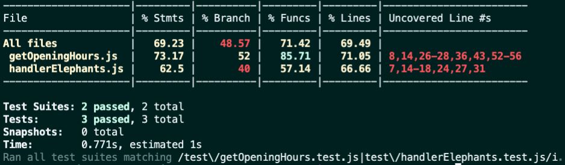
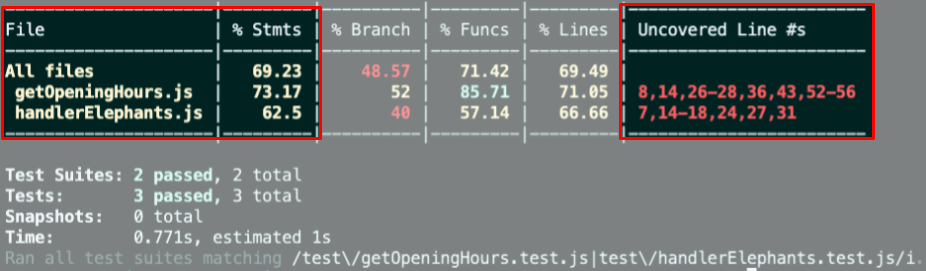

# Boas-vindas ao repositório do projeto Zoo Functions!

<details>
<summary><strong>🧑‍💻 O que deverá ser desenvolvido</strong></summary><br />

  Sabendo das suas habilidades com `ES6`, `Higher Order Functions` e testes, a prefeitura da cidade te deu uma importante missão: organizar as informações do zoológico! 🐘
  
  Você vai ser responsável por desenvolver funções que buscam informações sobre os animais do zoológico como: espécie e local de origem. Além disso, você também vai buscar dados sobre as pessoas que colaboram com a manutenção e cuidado do zoológico. 🧑‍🌾

  E não para por aí! 🤩

  Você já aprendeu sobre a importância de ter uma mentalidade orientada a testes, não é mesmo? E também já sabe como a implementação de testes contribui para a escrita de códigos mais confiáveis e com boa performance. 
  
  A sequência dos requisitos desse projeto foi disposta de forma a te proporcionar a experiência de entender na prática como o desenvolvimento orientado a testes ajuda a garantir um código de qualidade. Para isso, você vai implementar testes para funções já existentes, percebendo os casos de uso da sua aplicação e garantindo que ela está funcionando da maneira correta! 🚀 
</details>

## Cobertura de testes

Nesse projeto você precisará implementar testes para duas funções já criadas: `handlerElephants` e `getOpeningHours`.

Essa cobertura avalia a eficácia dos testes implementados de acordo com os requisitos, determinando se cobrem o que foi pedido ou não.

**Observação:**
- É importante destacar que a função `getOpeningHours` possui uma lógica específica para validar os horários 12am e 12pm. Portanto, para uma total cobertura, seus testes devem verificar também, como a função se comporta ao receber estes horários.

⚠️ **Serão testadas apenas as duas funções pedidas e não toda a aplicação!**

Conforme você for realizando os testes do projeto, a porcentagem da cobertura total irá aumentar. Para cada requisito de teste, será avaliada uma porcentagem de cobertura.

Para executar e acompanhar a implementação da sua cobertura de testes, rode o comando abaixo:

```bash
npm run test:coverage
```

Ao executar o comando você vai ter um resultado similar a este:



Neste projeto iremos focar na cobertura de *statements* (ou seja, as instruções em JavaScript). Será avaliada a porcentagem de cobertura das instruções das funções, conforme destacado na figura abaixo:



Além disso, a tabela também vai mostrar quais linhas ainda não cobertas por testes. Ou seja, quando não existe caso de teste que execute aquela instrução.

Verifique com `npm test` se todos os itens da cobertura dos testes estão passando corretamente.

⚠️ **Atenção**: cuidado com eventuais falso-positivos!

Ao rodar o comando de cobertura de teste, a pasta `coverage` será criada, com um arquivo `index.html`. Este arquivo apresenta um relatório da análise de cobertura. Neste relatório é possível visualizar quais linhas **não** estão sendo cobertas pelos testes.

⚠️ **O avaliador automático não necessariamente avalia seu projeto na ordem em que os requisitos aparecem no readme. Isso acontece para deixar o processo de avaliação mais rápido. Então, não se assuste se isso acontecer, ok?**

</details>
	
<details>
<summary><strong>🏗 Estrutura do projeto</strong></summary><br />

Na pasta raiz do projeto, temos as pastas `src`, `test`, `evaluator` e `data`.

A pasta `src` é composta por arquivos referentes a cada uma das funções que você irá implementar, a pasta `data` contém o arquivo `zoo_data.js`, que armazena os dados que você vai utilizar para retornar as informações sobre o zoológico.

Este projeto possui também alguns requisitos para a implementação de testes. A pasta `test`, contém os arquivos em que você implementará os testes unitários correspondentes a cada função, o nome do arquivo é o nome da função alvo acrescido do sufixo `.test.js`.

**Por exemplo:** o arquivo `src/getOpeningHours.js` conterá a implementação da função `getOpeningHours` e o arquivo `test/getOpeningHours.test.js` deve conter os testes que você vai desenvolver referentes a ela.

A pasta `evaluator` possui os testes automatizados que avaliarão o seu projeto; os conteúdos desta pasta não devem ser alterados.

<details>
  <summary>
    O arquivo <code>zoo_data.js</code> contém um <strong>objeto</strong> no seguinte formato:
  </summary> <br />

```javascript
{
	species: [
    {
      id: lionId,
      name: 'lions',
      popularity: 4,
      location: 'NE',
      availability: ['Tuesday', 'Thursday', 'Saturday', 'Sunday'],
      residents: [
        {
          name: 'Zena',
          sex: 'female',
          age: 12,
        }
      ],
    }
  ],
  employees: [
    {
      id: 'c5b83cb3-a451-49e2-ac45-ff3f54fbe7e1',
      firstName: 'Nigel',
      lastName: 'Nelson',
      managers: [burlId, olaId],
      responsibleFor: [lionId, tigersId],
    }
  ],
  hours: {
    Tuesday: { open: 8, close: 6 },
    Wednesday: { open: 8, close: 6 },
    Thursday: { open: 10, close: 8 },
    Friday: { open: 10, close: 8 },
    Saturday: { open: 8, close: 10 },
    Sunday: { open: 8, close: 8 },
    Monday: { open: 0, close: 0 },
  },
  prices: {
    adult: 49.99,
    senior: 24.99,
    child: 20.99,
  },
}
```

<details>
  <summary>
  O array <code>species</code> guarda as informações de cada espécie do zoológico
  </summary> <br />

  | Chave | Descrição |
  | ------------ | ----------|
  | `id`         | é o identificador da espécie |
  | `name`       | é o nome da espécie, por exemplo, `lions` |
  | `popularity` | é o popularidade daquela espécie |
  | `location`   | é a região que a espécie do animal veio, pode ter os seguintes valores: <br> - `NE`: nordeste; <br> - `NW`: noroeste; <br> - `SE`: sudeste; <br> - `SW`: sudoeste. |
  | `availability` | é a disponibilidade de visitação dos animais dessa espécie |
  | `residents`    | são as informações dos animais daquela espécie que residem no zoológico, onde: <br> - `name`: é o nome do animal, por exemplo `'Zena'`; <br> - `sex`: é o sexo do animal, por exemplo: `'female'` (fêmea); <br> - `age`: é a idade do animal. |

</details>

<details>
  <summary>
  O array <code>employees</code> é onde ficam as informações de cada pessoa colaboradora
  </summary> <br />

  | Chave | Descrição |
  | ----------- | ------ |
  | `id`        | é o identificador dessa pessoa |
  | `firstName` | é o primeiro nome dessa pessoa |
  | `lastName` | é o último nome dessa pessoa |
  | `managers` | são os `ids` das lideranças dessa pessoa |
  | `responsibleFor` | são os `ids` das espécies que essa pessoa é responsável |

</details>

<details>
  <summary>
  O objeto <code>hours</code> guarda as informações sobre o horários de funcionamento do zoológico
  </summary> <br />

  | Chave | Descrição|
  | ------ | ------ |
  | `Tuesday`<br> `Wednesday`<br> `Thursday`<br> `Friday`<br> `Saturday`<br> `Sunday`<br> `Monday` | são os dias da semana: <br> - `open`: é o horário que o zoológico abre; <br> - `close`: é o horário que o zoológico fecha. |

</details>

<details>
  <summary>
    O objeto <code>prices</code> é responsável por guardar as informações sobre o valor da entrada do zoológico
  </summary> <br />

  | Chave | Descrição |
  | -------- | ------ |
  | `adult`  | é o preço para adultos |
  | `senior` | é o preço para idosos |
  | `child`  | é o preço para crianças |

</details>

</details>

<br />

⚠️ **Apenas os arquivos indicados nos requisitos devem ser alterados, caso contrário, sua avaliação poderá ser comprometida.**

Todos os arquivos estritamente necessários para finalizar o projeto já estão criados, **não** sendo necessária a criação de outros arquivos.
	
</details>

<details>
<summary><strong>🏪 O que você deve desenvolver </strong></summary><br />

Você deve complementar as funções criadas dentro da pasta `src` e deverá criar testes para as funções já prontas `handlerElephants` e `getOpeningHours`.
	
</details>
## 1. Implemente a função `getSpeciesByIds`.

<details>
  <summary>
  Implemente a função <code>getSpeciesByIds</code> para buscar as espécies dos animais por meio de um <code>ID</code> e retorne um array contendo todos os animais dessa espécie. 
  </summary> <br />

- Faça com que a função `getSpeciesByIds` possa receber vários parâmetros;

- Retorne um array vazio se a função não receber um `id`;

- Retorne as seguintes informações do arquivo `data`:

  - Se a função receber apenas um `id`, retorne a espécie do animal referente a este `id`;

  - Se a função receber vários `ids`, retorne todas as espécies referente a esses `ids`.
</details>

---

## 2. Implemente a função `getAnimalsOlderThan`.

<details>
  <summary>
  Implemente a função <code>getAnimalsOlderThan</code> que deve receber uma espécie e uma idade como parâmetro, e então retornar se todos os animais dessa espécie possuem essa idade ou são mais velhos.
  </summary> <br />

- Verifique se todos os animais da espécie passada como parâmetro possuem a idade mínima:
  - Os animais devem ter essa idade ou serem mais velhos.

- Retorne um valor booleano.
</details>

---

## 3. Implemente a função `getEmployeeByName`.

<details>
  <summary>
    Implemente a função <code>getEmployeeByName</code> que deve buscar por pessoas colaboradoras através de seu primeiro ou último nome.
  </summary> <br />

- Retorne um objeto vazio caso a função não receba parâmetros;

- Retorne as informações da pessoa colaboradora caso o parâmetro seja igual ao nome **ou** igual ao último nome no seguinte formato:

```javascript
  {
    id: 'c5b83cb3-a451-49e2-ac45-ff3f54fbe7e1',
    firstName: 'Nigel',
    lastName: 'Nelson',
    managers: ['0e7b460e-acf4-4e17-bcb3-ee472265db83', 'fdb2543b-5662-46a7-badc-93d960fdc0a8'],
    responsibleFor: ['0938aa23-f153-4937-9f88-4858b24d6bce', 'e8481c1d-42ea-4610-8e11-1752cfc05a46'],
  }
```
</details>

---

## 4. Implemente a função `getRelatedEmployees`.

<details>
  <summary>
    Implemente a função <code>getRelatedEmployees</code> para verificar se uma pessoa colaboradora é gerente e quais pessoas ela lidera.
  </summary> <br />

- Considerando a boa prática de dividir o código em partes menores, o arquivo terá duas funções:

1. A função `isManager` será responsável por verificar se uma pessoa colaboradora é gerente:
    - Deve retornar `true` se o `id` passado for de uma pessoa gerente;
    - Deve retornar `false` se o `id` passado não for de uma pessoa gerente.

2. A função `getRelatedEmployees` será responsável por retornar as pessoas lideradas pela gerência:
      - Utilize a função `isManager` para verificar se a pessoa é gerente ou não e fazer as seguintes verificações:

        - Caso a pessoa seja gerente, retorne um array contendo nome e sobrenome das pessoas colaboradoras gerenciadas por essa pessoa.
</details>

---

## 5. Implemente a função `countAnimals`.

<details>
  <summary>
    Implemente a função <code>countAnimals</code> que deverá contabilizar a quantidade de espécies de animais residentes no zoológico.
  </summary> <br />

- A função `countAnimals` é responsável por contar a quantidade de animais que residem no zoológico.
  
- Retorne a quantidade de animais residentes por espécie caso não seja passado nenhum parâmetro. O retorno deverá ser um objeto cujo o nome de cada espécie é a chave e o total de animais (residentes) dessa espécie é o valor. Por exemplo:

```javascript
  {
    lions: 4,
    // [...]
  }
```

- Retorne a quantidade de animais residentes no zoológico da espécie passada por parâmetro. Por exemplo:

  - ao receber o argumento `{ species: 'penguins' }`, retorna apenas a quantidade (número) de pinguins que residem no zoológico;

  - ao passar o argumento `{ species: 'giraffes', sex: 'female' }`, retorna apenas a quantidade (número) de girafas fêmeas que residem no zoológico.
</details>

---

## 6. Obtenha ao menos 80% de cobertura de testes na função `handlerElephants`.

<details>
  <summary>
    Implemente os testes da função <code>handlerElephants</code> para obter ao menos 80% de cobertura
  </summary> <br />

Essa função retorna informações referentes aos elefantes conforme o argumento passado:

| Argumento | Informação |
| --------- | ---------- |
| `count` | retorna a quantidade de elefantes |
| `names` | retorna um array com a relação dos nomes de todos os elefantes |
| `averageAge` | retorna a média de idade dos elefantes |
| `location` | retorna a localização dos elefantes dentro do Zoológico |
| `popularity` | retorna a popularidade dos elefantes |
| `availability` | retorna um array com a relação de dias em que é possível visitar os elefantes |

- A função é case sensitive;
</details>

---

## 7. Obtenha ao menos 90% de cobertura de testes na função `handlerElephants`.

<details>
  <summary>
    Implemente os testes da função <code>handlerElephants</code> para obter ao menos 90% de cobertura
  </summary> <br />

Essa função retorna informações referentes aos elefantes conforme o argumento passado:

| Argumento | Informação |
| --------- | ---------- |
| `count` | retorna a quantidade de elefantes |
| `names` | retorna um array com a relação dos nomes de todos os elefantes |
| `averageAge` | retorna a média de idade dos elefantes |
| `location` | retorna a localização dos elefantes dentro do Zoológico |
| `popularity` | retorna a popularidade dos elefantes |
| `availability` | retorna um array com a relação de dias em que é possível visitar os elefantes |

- A função é case sensitive;
</details>

---

## 8. Implemente a função `calculateEntry`.

<details>
  <summary>
    Calcule o valor <strong>total</strong> da entrada dos visitantes do zoológico. 
  </summary> <br />

O valor das entradas do zoológico é calculado a partir da faixa etária, onde:

  - `child`: são pessoas **menores** de 18 anos;

  - `adult`: são pessoas com idade **maior ou igual** a 18 anos **e menor** que 50 anos;

  - `senior`: são pessoas com idade **maior ou igual** a 50 anos.

Considerando a boa prática de dividir o código em partes menores, o arquivo terá duas funções, chamadas de `countEntrants` e `calculateEntry`. 

As duas funções recebem um array no seguinte formato:

```javascript
const entrants = [
	{ name:  'Lara Carvalho', age:  5 },
	{ name:  'Frederico Moreira', age:  5 },
	{ name:  'Pedro Henrique Carvalho', age:  5 },
	{ name:  'Maria Costa', age:  18 },
	{ name:  'Núbia Souza', age:  18 },
	{ name:  'Carlos Nogueira', age:  50 },
];
```

1. A função `countEntrants` será responsável por calcular a quantidade de visitantes por faixa etária: 

  Ela recebe um array e deve retornar um **objeto**. Para isso:

  - Realize a soma da quantidade de visitantes por faixa etária;

  - Retorne um objeto em um formato como esse: `{ child: 3, adult: 2, senior: 1 }`.

2. A função `calculateEntry` será responsável por somar o valor da entrada das pessoas no zoológico:

  Ela recebe um array e deve retornar a soma **total** dos valores do ingresso. Para isso:

  - Retorne `0` se nenhum parâmetro for passado ou um array vazio;

  - Utilize a função `countEntrants` para ter a quantidade total de pessoas por faixa etária;

  - Realize a soma dos valores dos ingressos por faixa etária. Seu retorno deve ser parecido com esse: `187.94`.
</details>

---

## 9. Implemente a função `getSchedule`.

<details>
  <summary>
   Implemente a função <code>getSchedule</code> que irá disponibilizar um cronograma com os horários de visita da semana disponíveis para cada espécie de animal.
  </summary> <br />

  As informações dos horários dos animais devem ser disponibilizadas em uma consulta para as pessoas que estão visitando o zoológico, que podem querer ter acesso ao cronograma da semana, de um dia ou de um animal específico.

- Retorne um array com os dias da semana em que um animal está disponível para visitação caso o parâmetro da função seja um animal. Por exemplo:
    
   ```js
    getSchedule('lions');
    // o retorno será [ 'Tuesday', 'Thursday', 'Saturday', 'Sunday' ];
   ```

- Retorne um objeto com todos os horários disponíveis para cada dia da semana caso a função não receba parâmetro ou o parâmetro passado para a função não seja um animal ou um dia.
</details>

---

## 10. Implemente a função `getOldestFromFirstSpecies`.

<details>
  <summary>
    Implemente a função <code>getOldestFromFirstSpecies</code> que deverá encontrar o animal mais velho da espécie gerenciado por uma pessoa colaboradora.
  </summary> <br />

- A função recebe um parâmetro `ID` referente à pessoa colaboradora e a partir desse `ID`:

  - A função deverá encontrar a pessoa colaboradora que possui o `ID` passado por parâmetro;

  - A função deverá encontrar a **primeira** espécie de animal que a pessoa colaboradora é responsável;

  - A função deverá encontrar o animal mais velho daquela espécie;

  - A função deverá retornar um array com as informações do animal mais velho daquela espécie.
</details>

---

## 11. Implemente a função `getEmployeesCoverage`.

<details>
  <summary>
    Implemente a função <code>getEmployeesCoverage</code> que deverá retornar as informações sobre a pessoa colaboradora e por quais espécies ela é responsável.
  </summary> <br />

- A função vai receber um objeto como parâmetro que vai determinar o seu comportamento, sendo:

  - `name`: o nome **ou** sobrenome da pessoa a ser buscada;

  -  `id`: o id da pessoa a ser buscada.

- A função deve retornar um objeto no seguinte formato:

```javascript
{
	id: "4b40a139-d4dc-4f09-822d-ec25e819a5ad", // id da pessoa
	fullName: "Sharonda Spry", // nome completo: firstName + lastName
	species: [ "otters", "frogs" ], // espécies as quais a pessoa é responsável
	locations: [ "SE", "SW" ], // Um array contendo todas as localizações das espécies
}
```

  <details>
    <summary>
      Caso o parâmetro seja um objeto com nome e id, retorne as informações da pessoa colaboradora 
    </summary> <br />
</details>

  <details>
    <summary>
      Caso a função não receba parâmetros, retorne um array com a informação de <strong>todas</strong> as pessoas colaboradoras
    </summary> <br />
</details>

<details>
  <summary>
    Caso nenhuma pessoa seja encontrada com o nome, sobrenome ou id, lance um erro
  </summary> <br />

Caso nenhuma pessoa seja encontrada com o nome, sobrenome ou id, deverá ser lançado um erro gerado com a função construtora **Error** da biblioteca padrão do JavaScript com a mensagem **"Informações inválidas"**. Exemplo:

```javascript
throw new Error('Informações inválidas');
```
</details>

---

## 12. Obtenha ao menos 85% de cobertura de testes na função `getOpeningHours`.

<details>
  <summary>
    Implemente os testes da função <code>getOpeningHours</code> para obter ao menos 85% de cobertura
  </summary> <br />

Esta função recebe como argumentos um dia da semana e um horário, e retorna uma mensagem informando se o zoológico está aberto ou não naquela data e hora.
</details>

---

## 13. Obtenha ao menos 95% de cobertura de testes na função `getOpeningHours`.

<details>
  <summary>
    Implemente os testes da função <code>getOpeningHours</code> para obter 95% de cobertura
  </summary> <br />

  Esta função recebe como argumentos um dia da semana e um horário, e retorna uma mensagem informando se o zoológico está aberto ou não naquela data e hora.
</details>

---

## 14. Implemente a função `getAnimalMap`.

<details>
  <summary>
    Faça o mapeamento geográfico dos animais de cada espécie e realize filtros de localização, nome em ordem alfabética e sexo.
  </summary> <br />

- A função `getAnimalMap` é responsável por categorizar os animais por localização, além de filtrá-los por região, nome e sexo a partir de um parâmetro. A estrutura do retorno da função é baseada na localização das espécies:

```javascript
  {
    NE: [ /* dados aqui */],
    NW: [/* dados aqui */],
    SE: [/* dados aqui */],
    SW: [/* dados aqui */],
  }
```
  
   O parâmetro da função será um objeto que poderá conter:

   <details>
     <summary>
      <code>includeNames: true</code>, que retorna o nome dos animais no seguinte formato:
     </summary> <br />

```javascript
  NE: [
    { lions: ['Zena', 'Maxwell', 'Faustino', 'Dee'] },
    { giraffes: ['Gracia', 'Antone', 'Vicky', 'Clay', 'Arron', 'Bernard'] },
  ],
  // [...]
```
   </details>

<details>
  <summary>
    <code>sorted: true</code> que retorna o nome dos animais por ordem alfabética no seguinte formato:
  </summary> <br />

  ```javascript
  NE: [
    { lions: ['Dee', 'Faustino', 'Maxwell', 'Zena'] },
    { giraffes: ['Antone', 'Arron', 'Bernard', 'Clay', 'Gracia', 'Vicky'] },
  ],
  // [...]
```
</details>

<details>
  <summary>
    <code>sex: male</code> ou <code>sex: female</code> retorna o <strong>nome</strong> dos animais que são machos ou fêmeas no seguinte formato:
  </summary><br />

```javascript
  NE: [
    { lions: ['Zena', 'Dee'] },
    { giraffes: ['Gracia', 'Vicky'] },
  ],
  // [...]
```
</details>

<details>
  <summary>
  Caso a função não receba parâmetro, as espécies dos animais devem ser categorizadas por localização e deve retornar um objeto no seguinte formato:
  </summary> <br />

  ```javascript
  {
    NE: ['lions', 'giraffes'],
    NW: ['tigers', 'bears', 'elephants'],
    SE: ['penguins', 'otters'],
    SW: ['frogs', 'snakes'],
  }
  ```

</details>

Para isso:

  - Retorne a espécie de todos os animais categorizados por localização caso a função:

    - não receba parâmetro;

    - não receba o parâmetro `{includeNames: true}` e receba apenas o parâmetro `{sex: female}`;

    - não receba o parâmetro `{includeNames: true}` e receba apenas o parâmetro `{sex: female, sorted: true}`.

  - Retorne a espécie e o nome dos animais caso a função receba apenas o parâmetro `{includeNames: true}`;

  - Retorne a espécie e o nome dos animais em ordem alfabética caso a função receba o parâmetro `{includeNames: true, sorted: true}`;

  - Retorne a espécie e o nome dos animais filtrado por sexo:

    - Retorne a espécie e o nome dos animais fêmeas, caso o parâmetro da função seja `{includeNames: true, sex: female}`;

    - Retorne a espécie e o nome dos animais machos, caso o parâmetro da função seja `{includeNames: true, sex: male}`;

  - Retorne a espécie e o nome dos animais filtrado por sexo e por ordem alfabética:

    - Retorne a espécie e o nome dos animais fêmeas em ordem alfabética, caso o parâmetro da função seja `{includeNames: true, sex: female, sorted: true}`;

    - Retorne a espécie e o nome dos animais machos em ordem alfabética, caso o parâmetro da função seja `{includeNames: true, sex: male, sorted: true}`;
</details>

---

## 15. Obtenha 100% de cobertura de testes na função `handlerElephants`.

<details>
  <summary>
    Implemente os testes da função <code>handlerElephants</code> para obter 100% de cobertura
  </summary> <br />
</details>

---

## 16. Obtenha ao menos 100% de cobertura de testes na função `getOpeningHours`.

<details>
  <summary>
    Implemente os testes da função <code>getOpeningHours</code> para obter 100% de cobertura
  </summary> <br />

  Esta função recebe como argumentos um dia da semana e um horário, e retorna uma mensagem informando se o zoológico está aberto ou não naquela data e hora.
</details>